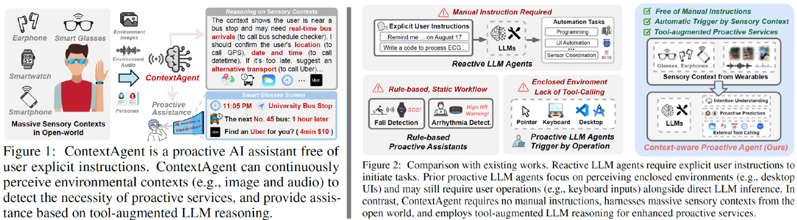
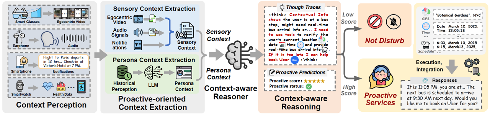
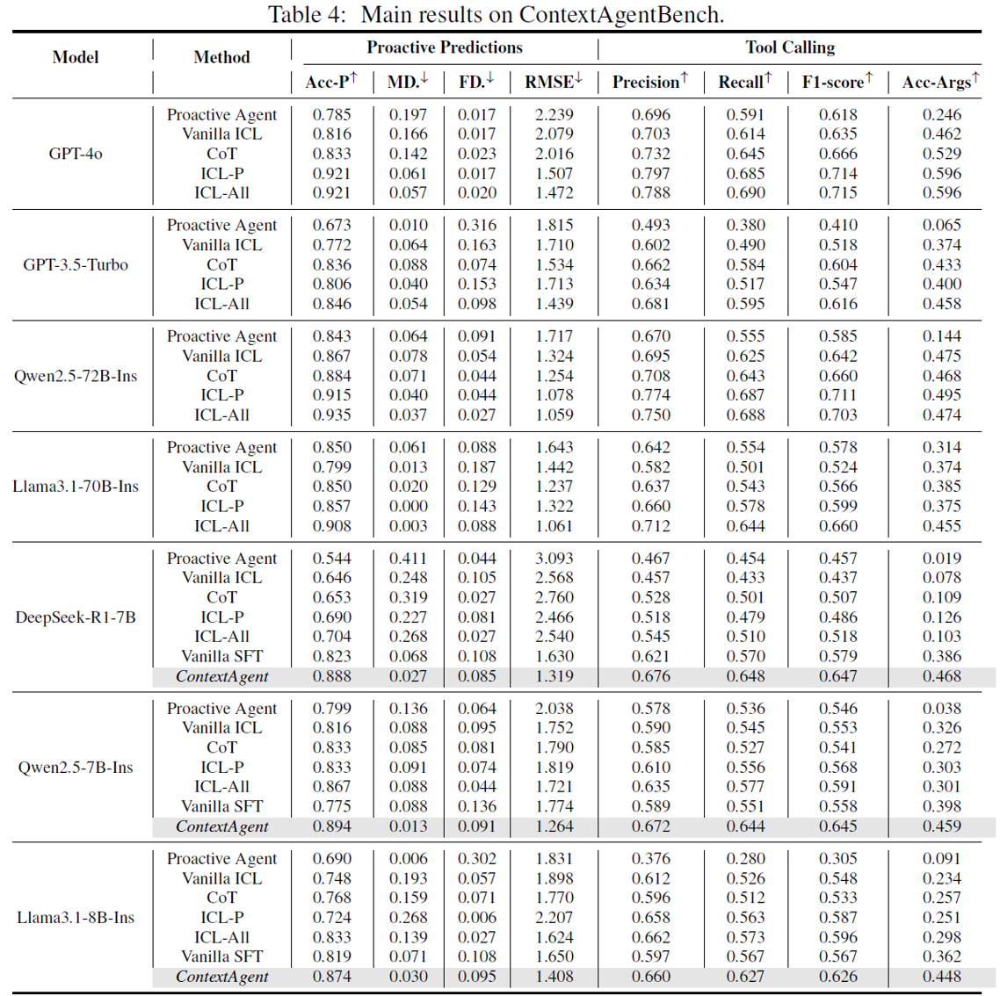
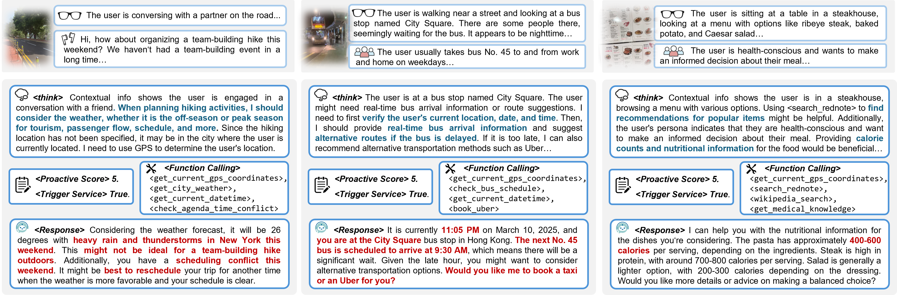
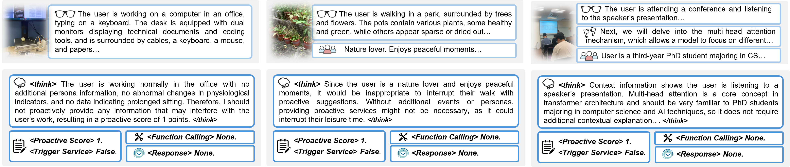

<br>
<p align="center">
<h1 align="center"><strong>ContextAgent: Context-Aware Proactive LLM Agents
with Open-World Sensory Perceptions</strong></h1>
  <p align="center">
    <a href='https://scholar.google.com/citations?user=q_KcYaQAAAAJ&hl=zh-CN' target='_blank'>Bufang Yang<sup>†</sup></a>&emsp;
    <a href='https://initxu.github.io/' target='_blank'>Lilin Xu<sup>†</sup></a>&emsp;
    <a href='https://acomze.github.io/' target='_blank'>Liekang Zeng</a>&emsp;
    <a href='https://www.linkedin.com/in/kaiwei-liu-743567219/?originalSubdomain=hk' target='_blank'>Kaiwei Liu</a>&emsp;
    <a href='http://syjiang.com/' target='_blank'>Siyang Jiang</a>&emsp;
    <a href='https://openreview.net/profile?id=~Wenrui_Lu3' target='_blank'>Wenrui Lu</a>&emsp; <br>
    <a href='https://www.ie.cuhk.edu.hk/faculty/chen-hongkai/' 
    target='_blank'>Hongkai Chen</a>&emsp;
    <a href='http://fredjiang.com/' target='_blank'>Xiaofan Jiang</a>&emsp;
    <a href='https://staff.ie.cuhk.edu.hk/~glxing/' target='_blank'>Guoliang Xing</a>&emsp;
    <a href='https://yanzhenyu.com/' target='_blank'>Zhenyu Yan</a>&emsp;
    <br>
    The Chinese University of Hong Kong&emsp;Columbia University
  </p>
</p>


## 🏠 About
<div style="text-align: center;">
    
</div>
In this paper, we introduce ContextAgent, the first context-aware proactive LLM agent that harnesses extensive sensory contexts for enhanced proactive services.


<!-- ## Overview -->

## Overview
<div style="text-align: center;">
    
</div>


## Experiment Results
Please refer to our paper for more results.
### Quantitative Results
<div style="text-align: center;">
    
</div>

### Qualitative Results
- Proactive Examples
<div style="text-align: center;">
    
</div>

- Non-proactive Examples
<div style="text-align: center;">
    
</div>

## 🔗 Citation

If you find our work and this codebase helpful, please consider starring this repo 🌟 and cite:

```bibtex
@article{yang2025contextagent,
  title={ContextAgent: Context-Aware Proactive LLM Agents with Open-World Sensory Perceptions},
  author={Yang, Bufang and Xu, Lilin and Zeng, Liekang and Liu, Kaiwei and Jiang, Siyang and Lu, Wenrui and Chen, Hongkai and Jiang, Xiaofan and Xing, Guoliang and Yan, Zhenyu},
  journal={arXiv preprint arXiv:2505.14668},
  year={2025}
}
```
